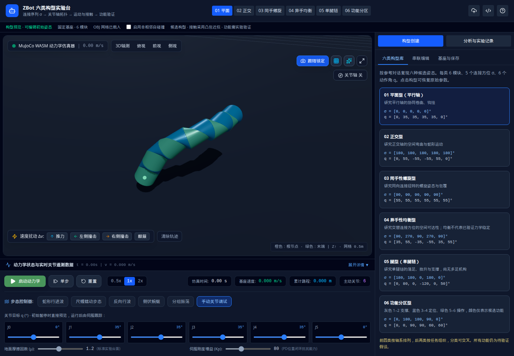
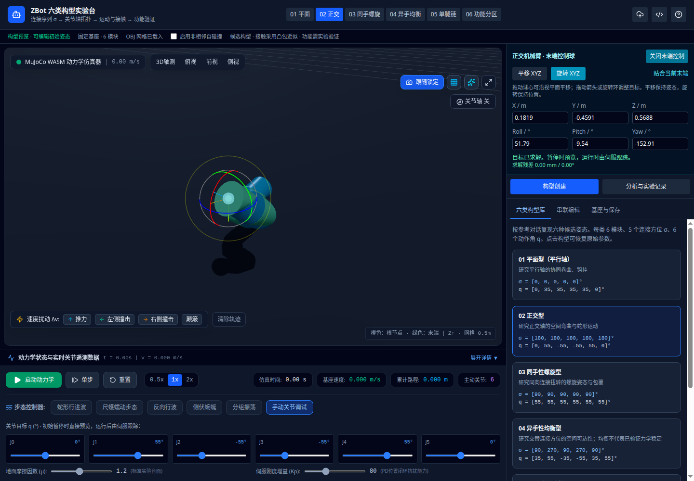

# 实施说明

## 修正的问题

原项目已有六类名称，但所有类别都标记为 snake；正交型与螺旋型的动作角不符合参考对话，另有未加闭环约束却称为闭环的预设。现保留六类明确参数的开放单链，并采用静态初始姿态用于创建与检查。

物理引擎此前直接把角度写入弧度控制接口，并以控制目标充当力矩、以弧度当作度显示。现使用模型编译后的名称与状态地址映射，角度单位在边界转换，读取实际广义驱动力矩。初始化和重置会恢复 q，运行频率依据时间步长而非屏幕刷新次数。

原始OBJ直接套用MuJoCo几何世界变换会叠加编译器的网格中心和惯性主轴变换。现对OBJ应用逆编译变换，再叠加geom世界变换；测试验证网格顶点世界位置。显示包含实时关节轴、末端和根节点标记。

串联编辑取消了不受约束的父节点选择，以避免循环和多个模块占用同一输出端面。导入校验所有数值、范围、轴向、身份及连接顺序；增删排序按身份保存控制目标。

## 模块分工

- `src/data/presets.ts`：六类参考 σ/q、候选用途和功能配色。
- `src/types/zbot.ts`、`src/utils/configuration.ts`：配置类型、校验、串联编辑与导入。
- `src/utils/kinematics.ts`：与原始斜轴几何一致的正运动学。
- `src/utils/xmlGenerator.ts`、`src/mujoco/MujocoEngine.ts`：MJCF生成、动力学控制、状态初始化和测量。
- `src/components/ConfigurationEditor.tsx`：构型库、串联编辑、保存恢复。
- `src/components/SimulationViewport.tsx`、`src/utils/meshManager.ts`：网格校验和真实坐标显示。
- `src/components/ResearchPanel.tsx`：轴系分析、实验快照与CSV/JSON导出。
- `src/App.tsx`：统一模型加载、暂停/重置与时间积分，防止参数状态与引擎不同步。

## 实验建议

先在固定基座、手动控制下比较初始轴系和末端；再以相同控制参数切换自由基座，分别记录相同仿真时刻的速度、路程、关节力矩与接触数。记录是否启用自碰撞。接触测试和步态演示只能支持该组参数下的观察，不能直接外推至实物或不同任务。

测试和构建结果以项目执行 `npm test`、`npm run lint`、`npm run build` 为准。无额外生产依赖。

## 本次验证证据

- `npm run lint`：通过（TypeScript静态检查）。
- `npm test`：20项通过，包括未知JSON校验、旧版配置恢复、身份保持、正运动学、OBJ处理与MuJoCo真实WASM。
- 真实 `public/assets/ma.obj` 和 `mb.obj`：六类 × 固定/自由基座 × 自碰撞开/关 × 手动/低幅行波，共48组，每组1000步（2秒），关节状态有限、时间连续、MuJoCo警告计数为零。
- 正运动学末端与MuJoCo初始末端误差小于1e-9，涵盖自定义根姿态与连接Euler角。
- 浏览器：六构型切换、启动/暂停、重置角度、轴线显示、模块增删、本地恢复、摩擦即时生效、JSON文件导入导出、CSV/JSON实验记录下载、无效XML提示与恢复均通过。
- 生产构建页面：启动/暂停/重置通过，无浏览器运行时异常；桌面和390px窄屏截图复核完成。
- 构建成功，仍有MuJoCo依赖的Node内置模块外置提示和较大前端包体提示；已实际验证生产浏览器路径。

这些测试验证数值运行和界面工作流，不构成实物性能、稳定性或任务能力证明。

## 正交机械臂末端控制扩展

新增 `src/utils/inverseKinematics.ts`、`src/utils/armTargetControl.ts`、`src/components/ArmControlPanel.tsx` 和 `tests/inverseKinematics.test.ts`，更新 `App.tsx`、`SimulationViewport.tsx`、`GaitControlPanel.tsx` 与 README。

复用现有正运动学和Three.js变换控制器，未增加依赖；界面角度标签缩短到一位小数，控制计算保留完整精度。目标与物理末端分离，未收敛结果不会下发。

验证：27项测试、TypeScript静态检查和生产构建通过。生产浏览器验证位置/姿态输入、球心拖动、旋转环拖动、不可达目标保持、贴合实际末端、运行时控制路径、重置和切换构型退出控制，未出现运行时异常。逆运动学是带限位的局部求解，不含避障；经典参考姿态附近某些方向受限。

