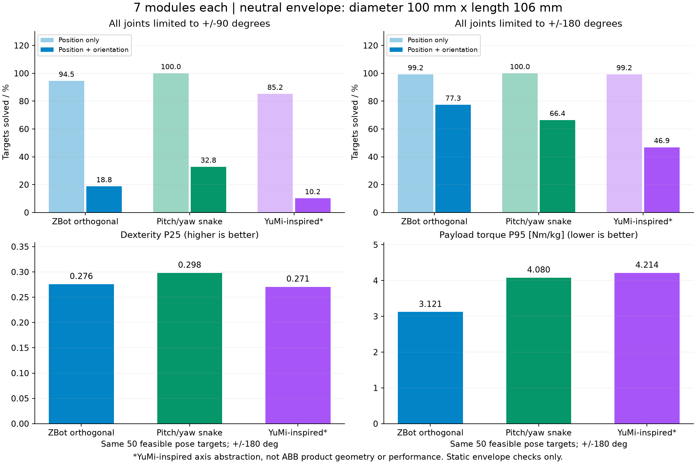

# 七模块等包络轴系比较

比较对象按最新要求统一为七模块：ZBot 正交型、标准交替俯仰／偏航蛇形链、YuMi 风格扭转／弯曲交替链。单模块包含连杆的零位外包络统一为直径 100 mm、长度 106 mm。

**本轮是三种等包络轴系抽象模型的计算对照。第三组不是 ABB YuMi 的精确缩比模型，不能将结果表述为“ZBot 优于 ABB YuMi 产品”。** 所有结构均没有长连杆，尚未完成可制造性与真实驱动布局验证。

## 结论

关节转角范围会改变任务覆盖排名。在共同 ±90° 限位下，蛇形链的测试位置和位姿覆盖较好；共同放宽到 ±180° 后，ZBot 正交型的位姿覆盖较好，且共同任务上的载荷与自重力矩系数较低。蛇形链的共同任务灵巧性略高。YuMi 风格等长短节链在本轮目标上的位姿覆盖较低，但不代表保留真实偏置与连杆比例的 YuMi 会得到同样结果。

不建议用任意加权总分掩盖这些取舍，更不能凭本轮数据给出额定负载公斤数。

## 统一条件与模型定义

| 条件 | 本轮定义 |
|---|---|
| 关节数 | 三组均为 7 个主动转动关节 |
| 模块包络 | 每模块两个半圆柱；零位合计直径100 mm × 长106 mm，铰链在中点 |
| 连杆预算 | 每段中性主轴长度106 mm，七段合计742 mm，不附加长连杆 |
| 基座 | 固定，位置 [0,0,0.35] m，竖直零位；未优化安装朝向 |
| 末端 | 最后模块输出端中心，没有夹爪、工具偏心或工具延伸 |
| 限位 | 所有关节统一 ±90°；另作统一 ±180° 敏感性测试 |
| 质量 | 每模块假定1 kg、两半各0.5 kg，仅用于质量归一化的重力系数 |
| 刚度 | 假设各关节具有相同独立扭转刚度K，连杆刚性，仅计算挠度系数 |
| 碰撞 | MuJoCo圆柱模型、地面、非相邻刚体碰撞，接触余量0.5 mm；相邻刚体排除 |

ZBot 网格零位范围实测约为 x/y各±50 mm、z从0到106 mm。为了不让 ZBot 使用精细壳体而另外两组使用粗包络，本轮三组一律使用相同半圆柱代理几何。ZBot 的关节运动学仍严格复现原有正交模型，并通过原 FK 和 MuJoCo 对照测试。

包络是零位外形约束，不是整个运动过程的扫掠包络。各半模块可绕铰链转动，因此其扫掠空间不同；接头内部与直接相邻刚体碰撞被排除。这不能证明大角度机构能制造或线缆可以通过，±180° 尤其只能作为共同运动学限位的敏感性条件。

轴系定义：

- ZBot：每个模块局部斜轴 (0,-1,1)/√2，六处对接角均为180°。
- 蛇形：零位局部轴按 X–Y–X–Y–X–Y–X 交替，全部关节轴横向于模块主轴。
- YuMi风格抽象：零位按 Z–Y–Z–Y–Z–Y–Z 的扭转／弯曲层次串联，统一直线中性主轴与中心铰链；去除了原机的非相交轴偏置及不同连杆长度。这个抽象不能重现原机的完整奇异结构。

原版 YuMi 每臂七轴，见 [ABB 官方说明](https://www.abb.com/global/en/areas/robotics/products/robots/collaborative-robots/single-arm-yumi)。真实 YuMi 的偏置和运动学比交替轴示意复杂，详见 [YuMi 运动学研究](https://arxiv.org/html/2505.23111v1)。标准蛇形的交替关节与 ±90° 示例见 [CMU 机器蛇设计与控制](https://www.ri.cmu.edu/pub_files/2014/6/d_rollinson_robotics_2014.pdf)。三组均没有套用商业产品的质量、额定负载、速度或重复精度。

## 工作区域与可达性

统一测试128个确定性目标位置：水平半径0.12–0.5 m，方位±90°，世界高度0.15–0.65 m；并为每点生成一个 SO(3) 方向目标。位置模式允许末端方向自由变化，位姿模式同时要求位置误差≤0.5 mm、方向误差≤0.01 rad。

| 指标 | ZBot正交 | 蛇形 | YuMi风格抽象 |
|---|---:|---:|---:|
| ±90°：位置找到无碰撞解 | 121/128（94.5%） | 128/128（100%） | 109/128（85.2%） |
| ±90°：位姿找到无碰撞解 | 24/128（18.8%） | 42/128（32.8%） | 13/128（10.2%） |
| ±180°：位置找到无碰撞解 | 127/128（99.2%） | 128/128（100%） | 127/128（99.2%） |
| ±180°：位姿找到无碰撞解 | 99/128（77.3%） | 85/128（66.4%） | 60/128（46.9%） |

这些百分比是这批任务上的“找到解的比例”，不是严格证明的全局可达率。关节初值、碰撞代理、零位、安装方向、目标分布和求解预算均会影响它。共同窄限位解被保留到宽限位测试，防止因初值变化产生虚假的非单调结果。

本轮没有给出“精确工作空间体积”。summary.json记录了4,096、8,192、16,384样本下的50 mm体素占用变化，但稀疏占用受采样密度影响，不能直接当作连续可达体积。七段742 mm也只是中性长度预算，并非各方向都能达到的有效工作半径。

## 灵巧性、力矩与刚度代理

以下只比较三组在 ±180° 下共同找到解的50个位姿目标。每个目标保留已找到解中完整位姿灵巧性最高的解，因此力矩并没有单独最小化。

| 指标 | ZBot正交 | 蛇形 | YuMi风格抽象 | 解释 |
|---|---:|---:|---:|---|
| 灵巧性P25 | 0.2758 | 0.2982 | 0.2707 | 归一化完整雅可比最小奇异值，较大较好 |
| 单位末端负载力矩P95 | 3.121 | 4.080 | 4.214 | Nm/kg，较小表示所选姿态的驱动负担较低 |
| 单位模块质量自重力矩P95 | 10.080 | 13.149 | 13.342 | Nm／(kg每模块)，统一质量分布假设下较小较好 |
| 垂直柔顺系数P95 | 0.2699 | 0.2502 | 0.2509 | m²；除以共同关节刚度K后得到m/N，较小较好 |

P25为第25百分位，P95为第95百分位，均采用排序后向下取索引，不是最坏工况保证。在 ±90° 下仅7个位姿目标为三组共同成功样本，样本太少，不用其力矩／灵巧性分位数作主要排名；原始数据仍保留。

定义与使用方法：

1. 灵巧性使用 Jn=[Jp/0.3; Jω]，0.3 m特征长度对三组相同。该指标描述单位关节速度范数下局部运动能力，不等于全局覆盖、控制精度或碰撞避障能力。
2. 末端单位质量力矩为 Jpᵀ[0,0,-9.81]，取关节绝对值最大值。它只有末端对接面集中质量，无工具重心偏移和动态惯性；数值较低不意味着已验证更高额定载荷。
3. 自重系数来自每模块1 kg均匀半圆柱模型的静态 qfrc_bias。真实每模块质量为m kg时，该模型对应的自重项为m倍逐关节系数。各模型的质量相同是额外假设，不是由包络相同推导出来的事实。
4. 实际所需静态驱动力矩可按每个关节计算 τ=m·g_unit−p·τ_external_unit，其中p为末端集中质量kg。本报告的两个P95汇总值不能直接相加，更不能取它们的比值作为额定负载。
5. 垂直柔顺系数为 ΣJp,z,i²。对单位垂直力、同一关节扭转刚度K，δz=ΣJp,z,i²/K；不包含连杆弯曲、轴承与接口变形、回差和控制误差，不能换算成真实重复定位精度。

因此，在本轮宽限位条件下，ZBot在“较高位姿覆盖＋较低归一化重力力矩”上占优；蛇形在共同任务的局部灵巧性略高；YuMi风格抽象与蛇形的垂直柔顺系数略低。没有一个方案在所有指标上同时最优。

## 数值方法与复核

每个模型、每种限位先使用16,384个相同序列Halton样本。记录碰撞筛查后的姿态、体素占用和灵巧性。为了避免高碰撞占比模型缺少IK初值，再补充样本，目标为至少4,096个无碰撞初值，额外采样上限131,072。每个目标最多尝试距离最近的32个初值。保留首轮16初值的已验证结果，并继承窄限位下的解。

首轮每组三个模型都使用相同原始采样预算，但蛇形宽限位的无碰撞样本较少，因此增加条件初值池是必要的求解公平性复核。即便如此，仍不能保证找到所有分支或全局可达域。具体追加次数在summary.json中。

测试覆盖了：ZBot抽象模型与原FK一致、三组雅可比的有限差分校验、MuJoCo与FK末端一致、三组总标称质量均为7 kg、静态重力力矩与势能导数一致。项目40项测试、类型检查和生产构建通过。构建保留了原有MuJoCo外置模块和较大包体提示。

本轮未模拟运动轨迹、额定速度、温升、驱动饱和、机械疲劳或实物承载，也没有对三组分别优化几何。若下一轮要比较真实 YuMi式设计，应在同包络预算内优化关节偏置及接口位置，再做同一任务与实物参数的验证；目前不能以简化轴系模型代替该工作。

## 文件与重现

- summary.json：指标、统一假设、共同任务索引。
- details.json：逐目标解、关节角、逐关节单位负载／自重力矩。
- details-initial.json：首轮已验证解，供加密初值复核继承。
- targets.json：共同目标位置与四元数。
- zbot/snake/yumi_style 的90/180 XML：统一代理几何的MuJoCo模型，无原始商业CAD与额定参数。
- comparison.png/svg：本页图表。

运行 `npm run design:compare` 可重算本轮实验；脚本会读取 details-initial.json 继承首轮有效解。绘图运行 `python scripts/plot-architectures.py`，需要matplotlib。所有结果用于本轮定义的抽象模型，不覆盖之前的真实ZBot CAD筛选结果。
