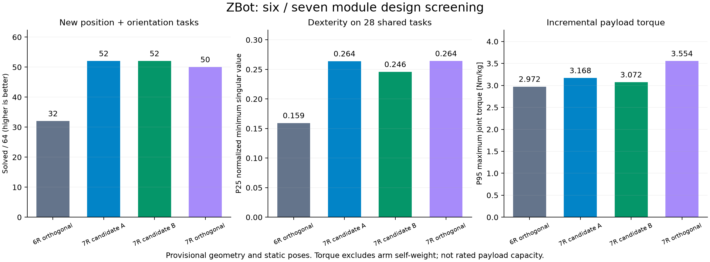
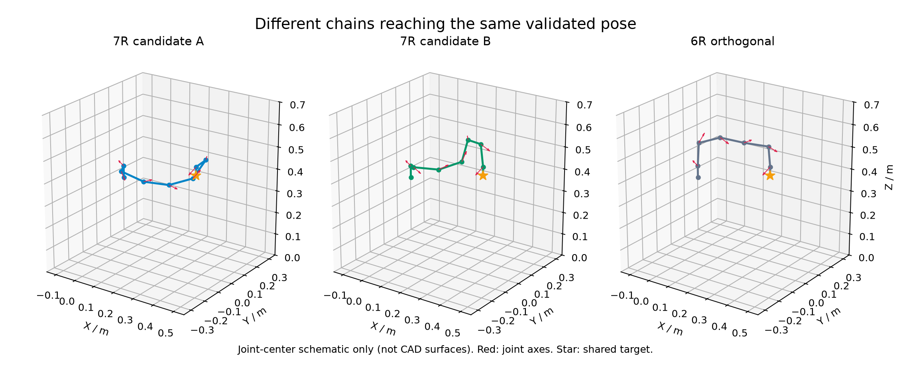

# ZBot 六／七模块机械臂初步设计

本轮建议优先制作或进一步仿真七模块 A，同时保留七模块 B 和六模块正交基准。这里的“优先”基于临时通用操作区域的运动学结果，不是额定承载或综合最优认证。

## 三个交付方案

| 方案 | 从基座到末端的连接方位 σ／度 | 定位 |
|---|---|---|
| 七模块 A | 180, 270, 180, 180, 180, 180 | 本轮主候选：测试覆盖与共同任务灵巧性较好 |
| 七模块 B | 180, 180, 90, 180, 180, 180 | 备选：独立测试覆盖与 A 相同，共同任务单位载荷力矩略低 |
| 六模块正交基准 | 180, 180, 180, 180, 180 | 模块较少，保留作自重、成本和驱动力矩对照 |

可导入文件：[七模块 A](design_7_232222.json)、[七模块 B](design_7_221222.json)、[六模块正交基准](design_6_22222.json)。在实验台“基座与保存”导入构型 JSON，开启非相邻自碰撞，再开启末端控制即可检查。文件包含一个经过静态碰撞筛查的初始姿态；这不是唯一工作姿态，也没有验证到其他目标的连续路径。

安装时 σ 指模块对接面的局部 z 轴转角，不是电机动作角 q。七模块 A 从基座向外第二处接口采用 270°，其余五处接口均为 180°；七模块 B 第三处接口采用 90°，其余五处接口均为 180°。必须按 CAD 的零位、轴向与正转方向装配；本轮假设这些锁定角度均可实现，尚无实物确认。

固定基座，模块标准斜轴为 (0,-1,1)/√2，模块节距 106 mm。保持原始网格，不增加虚构球肩、球腕或轻质连杆。七模块多一个驱动和一段结构；相同模块条件下模块总质量较六模块增加约 16.7%，但实际整机增重比例还取决于夹爪、基座和线束。

## 独立目标复核结果

第一次筛选后，另外生成 64 个新位置与任意方向四元数目标，使用新的关节种子集，每个目标最多尝试 8 个局部 IK 初值。以下任务数是计算找到无碰撞解的数量，不是对真实可达率的精确测量。

| 构型 | 新位姿目标找到解 | 共同 28 个目标的灵巧性 P25 ↑ | 共同目标的附加载荷力矩 P95／Nm·kg⁻¹ ↓ |
|---|---:|---:|---:|
| 七模块 A | 52 / 64 | 0.2638 | 3.168 |
| 七模块 B | 52 / 64 | 0.2458 | 3.072 |
| 七模块全正交对照 | 50 / 64 | 0.2641 | 3.554 |
| 六模块正交基准 | 32 / 64 | 0.1592 | 2.972 |
| 六模块粗筛位姿领先候选：180,180,180,180,90 | 30 / 64 | 0.1703 | 3.279 |



灵巧性取雅可比最小奇异值，平移部分统一除以 0.3 m，使平移与转动尺度统一。表中为各构型均找到解的相同 28 个任务的第 25 百分位，避免把不同成功任务集合当作公平的灵巧性或力矩比较。每个任务保留已找到解中灵巧性最高的一个，没有单独最小化力矩。

附加载荷力矩是末端对接面每增加 1 kg 集中质量、受世界坐标向下重力时，各关节附加力矩绝对值的最大值，再对共同任务取 P95。它排除了机械臂自重、工具偏心、动态惯性、摩擦、刚度和电机额定值。例如 A 的 3.168 Nm/kg 绝不能解读成“某电机额定力矩除以它就是机械臂额定负载”。P95 也不是最坏情况上界，逐任务逐关节数值保存在 JSON 中。

A、B 在这批目标上都有较好的覆盖，A 的共同任务灵巧性略高，B 的附加载荷力矩略低。全正交七模块的共同任务灵巧性与 A 几乎相同，而覆盖差仅为两个目标，不能据此宣称它显著落后。六模块保留了较少模块和较低附加载荷力矩的优势。



图为关节中心示意，不是壳体形状；三条链到达相同位置和姿态，展示七模块可以采用不同内部姿态。真实几何碰撞检查使用仓库的 ma.obj、mb.obj 凸包模型。

## 本轮如何计算

1. 枚举六模块的 1,024 组和七模块的 4,096 组 σ∈{0,90,180,270}，合计 5,120 组。没有按对称性删去候选。
2. 所有构型均使用基座位置 [0,0,0.35] m、姿态 [0,0,0]°、关节范围 [-180,180]°。这是统一竖直安装假设，与原六类预设的 [90,0,0]° 安装不同。未联合搜索安装姿态。
3. 粗筛每组使用 256 个确定性 Halton 关节样本，其中 32 个评价完整位姿灵巧性。分别取每种模块数的空间体素覆盖前四和灵巧性前四，加入原六类构型及四种规则七模块对照，共 26 个详细候选。粗筛未检查碰撞，是启发式缩小范围，不能保证保留全局最优。
4. 每个详细候选使用 4,096 个新样本。通过 MuJoCo、真实 OBJ 凸包、非相邻自碰撞及地面接触筛查；只保留 ncon=0 姿态，含原模型 0.5 mm 接触余量。继承相邻刚体排除规则，没有夹爪、线束、安装座及外部障碍几何。
5. 使用相同的 27 个位置目标：水平半径 0.2/0.35/0.5 m、方位 -60/0/60°、世界高度 0.2/0.35/0.5 m。另配三种固定姿态，共 81 个位姿目标，每个最多三个初值。A 找到 27/27 位置与 60/81 位姿解，B 为 26/27、56/81，七模块全正交为 26/27、53/81，六模块正交为 22/27、29/81。
6. 针对五个重点方案使用独立复核：64 个新目标位于水平半径 0.18–0.5 m、方位 ±75°、高度 0.2–0.55 m 的区域；方向通过均匀 SO(3) 四元数参数化生成。每构型使用新的 8,192 个种子样本，最多八初值，所有结果再次过滤碰撞。
7. 五个重点导出构型的初始姿态经真实 MuJoCo 检查无接触，末端位置与正运动学一致到 1e-8 m。分析公式新增测试覆盖了有效六／七模块、特征值求解和有限差分重力力矩校验。

所有角度均以度存储，求解器中雅可比关节速度按弧度定义。局部 IK 失败可能来自初值、限位或局部极小值，不能证明不存在解。自由基座、碰撞规避路径、持续运行、温升与承载能力均未在本轮设计评价中验证。

## 工作空间与综合最优的边界

粗筛的稀疏体素占用容易受采样密度影响。详细输出同时保留 3/5/8 cm 网格结果，但它们仍是采样占用量，并非已收敛的连续工作空间体积估计；本报告不据此给出精确体积排名。任务目标本身也是临时假设，平面型的 0/27 只说明它不适合这批离开自身运动平面的目标，不代表它没有工作空间。

pareto.json 仅为粗任务集上的探索性非支配集合：位置／位姿解数量、成功任务灵巧性和模块数量。其成功任务集合不同，灵巧性不能作无条件公平比较；不把这个集合称为载荷综合最优集合。实际设计决策以共同目标复核表和今后的任务约束为准。

要完成承载设计，还需模块质量、重心、连续输出力矩、关节刚度、回差、接口抗弯与锁紧能力，以及夹爪质量和重心。下一轮应在真实参数约束下比较 A／B／六模块基准的自重补偿、工作姿态与轨迹，筛除力矩超限、碰撞和变形过大的方案。已保存逐目标解，可以在补齐参数后复用，不必重做全部几何搜索。

## 重现与文件

在仓库根目录执行：

```bash
npm ci
npm run design:screen -- --fresh
npm run design:validate
npm test
npm run lint
npm run build
```

不加 --fresh 会读取已有 screening.json；修改采样规则、几何或指标后应重新粗筛。绘图脚本 scripts/plot-arm-designs.py 需要 Python 和 matplotlib，并使用保存的 plot-data.json 示意姿态数据；它不参与评分。

- assumptions.json：详细假设与第一轮任务坐标。
- provenance.json：运行环境与核心源文件、CAD、锁文件的 SHA-256。
- screening.json：全部 5,120 组粗筛结果。
- shortlist.json、detailed.json：26 组详细结果和逐目标解。
- validation.json：独立目标复核和共同任务比较。
- comparison.csv：便于读取的第一轮摘要。
- design_*.json：可导入实验台的构型，不覆盖原始预设。

验证结果：37 项测试、TypeScript 检查和生产构建通过。生产构建仍有原有 MuJoCo Node 内置模块外置与较大包体提示。
